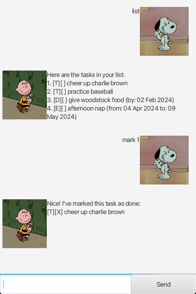

# Bee User Guide

Bee is a task management application that helps you keep track of your todos, deadlines, and events through a simple command-line interface.

## Features

### Adding a todo task: `todo`

Adds a simple todo task to your task list.

**Format:** `todo DESCRIPTION`

**Example:** `todo read book`

**Expected output:** 
Got it. I've added this task: [T][ ] read book Now you have 1 tasks in the list.

### Adding a deadline: `deadline`

Adds a task with a deadline to your task list.

**Format:** `deadline DESCRIPTION /by DATE`

**Example:** `deadline submit report /by 2024-12-31`

**Expected output:** Got it. I've added this task: [D][ ] submit report (by: Dec 31 2024) Now you have 2 tasks in the list.

### Adding an event: `event`

Adds an event with start and end times to your task list.

**Format:** `event DESCRIPTION /from START /to END`

**Example:** `event team meeting /from 2024-12-25 /to 2024-12-25`

**Expected output:** Got it. I've added this task: [D][ ] submit report (by: Dec 31 2024) Now you have 2 tasks in the list.

### Listing all tasks: `list`

Displays all tasks in your task list.

**Format:** `list`

**Expected output:** Here are the tasks in your list: 1.[T][ ] read book 2.[D][ ] submit report (by: Dec 31 2024) 3.[E][ ] team meeting (from: Dec 25 2024 to: Dec 25 2024)

### Marking a task as done: `mark`

Marks a task as completed.

**Format:** `mark INDEX`

**Example:** `mark 1`

**Expected output:** Nice! I've marked this task as done: [T][X] read book

### Unmarking a task: `unmark`

Marks a completed task as not done.

**Format:** `unmark INDEX`

**Example:** `unmark 1`

**Expected output:** Oops! I've marked this task as not done yet: [T][ ] read book

### Deleting a task: `delete`

Removes a task from your task list.

**Format:** `delete INDEX`

**Example:** `delete 1`

**Expected output:** Noted. I've removed this task: [T][ ] read book Now you have 2 tasks in the list.

### Finding tasks: `find`

Searches for tasks containing a specific keyword.

**Format:** `find KEYWORD`

**Example:** `find report`

**Expected output:** Here are the matching tasks in your list: 1.[D][ ] submit report (by: Dec 31 2024)

### Postponing a deadline: `postpone deadline`

Changes the deadline date of a deadline task.

**Format:** `postpone deadline INDEX NEW_DATE`

**Example:** `postpone deadline 2 2025-01-15`

**Expected output:** Noted. I've postponed this deadline task: [D][ ] submit report (by: Jan 15 2025)

### Postponing an event: `postpone event`

Changes the start and end dates of an event.

**Format:** `postpone event INDEX NEW_START NEW_END`

**Example:** `postpone event 3 2025-01-10 2025-01-11`

**Expected output:** Noted. I've postponed this task: [E][ ] team meeting (from: Jan 10 2025 to: Jan 11 2025)

## Command Summary

| Command | Format | Example |
|---------|--------|---------|
| Todo | `todo DESCRIPTION` | `todo read book` |
| Deadline | `deadline DESCRIPTION /by DATE` | `deadline submit report /by 2024-12-31` |
| Event | `event DESCRIPTION /from START /to END` | `event meeting /from 2024-12-25 /to 2024-12-25` |
| List | `list` | `list` |
| Mark | `mark INDEX` | `mark 1` |
| Unmark | `unmark INDEX` | `unmark 1` |
| Delete | `delete INDEX` | `delete 1` |
| Find | `find KEYWORD` | `find report` |
| Postpone Deadline | `postpone deadline INDEX DATE` | `postpone deadline 2 2025-01-15` |
| Postpone Event | `postpone event INDEX START END` | `postpone event 3 2025-01-10 2025-01-11` |

## Notes

- Dates should be in the format `YYYY-MM-DD`
- Task indices start from 1
- Tasks are automatically saved to `data/bee.txt`